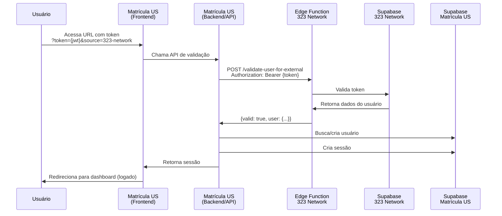

# 💻 Exemplo de Implementação SSO - Matrícula US

**Versão**: 1.0  
**Data**: 2026-01-02  
**Contexto**: Integração SSO entre 323 Network e Matrícula US

---

## 📋 Visão Geral

Este documento fornece exemplos práticos de como implementar a integração SSO no lado do Matrícula US.

---

## 🔄 Fluxo Completo


```mermaid
sequenceDiagram
    participant User as Usuário
    participant MatriculaUS as Matrícula US<br/>(Frontend)
    participant MatriculaUSBackend as Matrícula US<br/>(Backend/API)
    participant EdgeFunc as Edge Function<br/>323 Network
    participant Supabase323 as Supabase<br/>323 Network
    participant SupabaseMU as Supabase<br/>Matrícula US

    User->>MatriculaUS: Acessa URL com token<br/>?token={jwt}&source=323-network
    MatriculaUS->>MatriculaUSBackend: Chama API de validação
    MatriculaUSBackend->>EdgeFunc: POST /validate-user-for-external<br/>Authorization: Bearer {token}
    EdgeFunc->>Supabase323: Valida token
    Supabase323->>EdgeFunc: Retorna dados do usuário
    EdgeFunc->>MatriculaUSBackend: {valid: true, user: {...}}
    MatriculaUSBackend->>SupabaseMU: Busca/cria usuário
    MatriculaUSBackend->>SupabaseMU: Cria sessão
    MatriculaUSBackend->>MatriculaUS: Retorna sessão
    MatriculaUS->>User: Redireciona para dashboard (logado)
```

---

## 🎯 Implementação no Matrícula US

### Opção 1: Página de Callback (Recomendada)

Criar uma página/rota que recebe o token e processa a autenticação.

#### 1.1 Criar Página de Callback

**Arquivo**: `src/views/AuthCallback323Network.vue` (ou similar)

```vue
<template>
  <div class="flex items-center justify-center min-h-screen">
    <div class="text-center">
      <div class="animate-spin rounded-full h-12 w-12 border-b-2 border-primary mx-auto mb-4"></div>
      <p class="text-gray-600 dark:text-gray-400">{{ message }}</p>
    </div>
  </div>
</template>

<script setup lang="ts">
import { onMounted } from 'vue'
import { useRoute, useRouter } from 'vue-router'
import { useSupabase } from '@/composables/useSupabase'
import { toast } from 'vue-sonner'

const route = useRoute()
const router = useRouter()
const { supabase } = useSupabase()

const message = ref('Validando autenticação...')

onMounted(async () => {
  try {
    // Obter token da query string
    const token = route.query.token as string
    const source = route.query.source as string
    const returnTo = (route.query.returnTo as string) || '/dashboard'

    if (!token) {
      throw new Error('Token não fornecido')
    }

    if (source !== '323-network') {
      throw new Error('Origem inválida')
    }

    message.value = 'Validando token com 323 Network...'

    // Chamar Edge Function do 323 Network para validar token
    const response = await fetch(
      'https://pgdvbanwumqjmqeybqnw.supabase.co/functions/v1/validate-user-for-external',
      {
        method: 'POST',
        headers: {
          'Authorization': `Bearer ${token}`,
          'Content-Type': 'application/json',
        },
      }
    )

    if (!response.ok) {
      throw new Error(`Erro ao validar token: ${response.status}`)
    }

    const data = await response.json()

    if (!data.valid || !data.user) {
      throw new Error('Token inválido ou expirado')
    }

    message.value = 'Criando sessão...'

    // Buscar ou criar usuário no Matrícula US
    const user = await findOrCreateUser(data.user)

    // Criar sessão no Matrícula US
    await createSession(user, token)

    message.value = 'Redirecionando...'

    // Redirecionar para página desejada
    if (returnTo.startsWith('http')) {
      window.location.href = returnTo
    } else {
      router.push(returnTo)
    }
  } catch (error: any) {
    console.error('Erro no callback SSO:', error)
    toast.error(error.message || 'Erro ao processar autenticação')
    message.value = 'Erro ao processar autenticação'
    
    // Redirecionar para login após 3 segundos
    setTimeout(() => {
      router.push({ name: 'Login' })
    }, 3000)
  }
})

async function findOrCreateUser(userData: any) {
  // Buscar usuário existente por email
  const { data: existingUser } = await supabase
    .from('auth.users')
    .select('id')
    .eq('email', userData.email)
    .single()

  if (existingUser) {
    // Usuário já existe - atualizar profile se necessário
    await supabase
      .from('user_profiles')
      .update({
        full_name: userData.full_name,
        phone: userData.phone,
        country: userData.country,
        updated_at: new Date().toISOString(),
      })
      .eq('user_id', existingUser.id)

    return existingUser
  }

  // Criar novo usuário usando Admin API
  const { data: newUser, error: createError } = await supabase.auth.admin.createUser({
    email: userData.email,
    email_confirm: userData.email_confirmed,
    user_metadata: {
      source: '323-network',
      external_id: userData.id, // ID do 323 Network
      full_name: userData.full_name,
      first_name: userData.first_name,
      last_name: userData.last_name,
    },
  })

  if (createError) {
    throw new Error(`Erro ao criar usuário: ${createError.message}`)
  }

  // Criar user_profiles
  await supabase
    .from('user_profiles')
    .insert({
      user_id: newUser.user.id,
      email: userData.email,
      full_name: userData.full_name,
      phone: userData.phone,
      country: userData.country,
    })

  return newUser.user
}

async function createSession(user: any, token: string) {
  // Opção 1: Usar Admin API para criar sessão (requer Service Role Key)
  // Esta é a forma mais segura, mas requer backend
  
  // Opção 2: Usar setSession com o token do 323 Network
  // ⚠️ ATENÇÃO: Isso só funciona se ambos os projetos compartilharem o mesmo JWT Secret
  // Como não compartilhamos, precisamos criar sessão própria
  
  // Opção 3: Gerar novo token para o Matrícula US
  // Usar Admin API para gerar link de magic link ou criar sessão diretamente
  
  // Exemplo usando Admin API (requer Service Role Key no backend)
  const { data: sessionData, error: sessionError } = await supabase.auth.admin.generateLink({
    type: 'magiclink',
    email: user.email,
  })

  if (sessionError) {
    throw new Error(`Erro ao criar sessão: ${sessionError.message}`)
  }

  // Usar o link gerado ou criar sessão manualmente
  // Nota: Esta é uma abordagem simplificada - em produção, use backend seguro
}
</script>
```

#### 1.2 Adicionar Rota

**Arquivo**: `src/router/index.ts` (ou similar)

```typescript
{
  path: '/auth/callback',
  name: 'AuthCallback323Network',
  component: () => import('@/views/AuthCallback323Network.vue'),
  meta: { requiresAuth: false }
}
```

---

### Opção 2: Backend API (Mais Seguro)

Criar endpoint no backend do Matrícula US que processa a autenticação.

#### 2.1 Endpoint Backend (Node.js/Express exemplo)

```typescript
// routes/auth.ts
import express from 'express'
import { createClient } from '@supabase/supabase-js'

const router = express.Router()

router.post('/sso/validate', async (req, res) => {
  try {
    const { token } = req.body

    if (!token) {
      return res.status(400).json({ error: 'Token não fornecido' })
    }

    // Chamar Edge Function do 323 Network
    const response = await fetch(
      'https://pgdvbanwumqjmqeybqnw.supabase.co/functions/v1/validate-user-for-external',
      {
        method: 'POST',
        headers: {
          'Authorization': `Bearer ${token}`,
          'Content-Type': 'application/json',
        },
      }
    )

    if (!response.ok) {
      return res.status(401).json({ error: 'Token inválido' })
    }

    const data = await response.json()

    if (!data.valid || !data.user) {
      return res.status(401).json({ error: 'Token inválido' })
    }

    // Criar cliente Supabase Admin para Matrícula US
    const supabaseAdmin = createClient(
      process.env.SUPABASE_URL!,
      process.env.SUPABASE_SERVICE_ROLE_KEY!
    )

    // Buscar ou criar usuário
    const { data: existingUser } = await supabaseAdmin.auth.admin.listUsers()
    const userExists = existingUser?.users?.some(u => u.email === data.user.email)

    let userId: string

    if (userExists) {
      const user = existingUser.users.find(u => u.email === data.user.email)
      userId = user!.id

      // Atualizar profile
      await supabaseAdmin
        .from('user_profiles')
        .update({
          full_name: data.user.full_name,
          phone: data.user.phone,
          country: data.user.country,
        })
        .eq('user_id', userId)
    } else {
      // Criar novo usuário
      const { data: newUser, error: createError } = await supabaseAdmin.auth.admin.createUser({
        email: data.user.email,
        email_confirm: data.user.email_confirmed,
        user_metadata: {
          source: '323-network',
          external_id: data.user.id,
        },
      })

      if (createError) {
        throw createError
      }

      userId = newUser.user.id

      // Criar profile
      await supabaseAdmin
        .from('user_profiles')
        .insert({
          user_id: userId,
          email: data.user.email,
          full_name: data.user.full_name,
          phone: data.user.phone,
          country: data.user.country,
        })
    }

    // Gerar sessão para o usuário
    const { data: sessionData, error: sessionError } = await supabaseAdmin.auth.admin.generateLink({
      type: 'magiclink',
      email: data.user.email,
    })

    if (sessionError) {
      throw sessionError
    }

    // Retornar dados da sessão
    res.json({
      success: true,
      userId,
      session: sessionData,
    })
  } catch (error: any) {
    console.error('Erro ao processar SSO:', error)
    res.status(500).json({ error: error.message })
  }
})

export default router
```

#### 2.2 Frontend chama Backend

```typescript
// No componente de callback
async function handleSSOCallback(token: string) {
  try {
    const response = await fetch('/api/auth/sso/validate', {
      method: 'POST',
      headers: {
        'Content-Type': 'application/json',
      },
      body: JSON.stringify({ token }),
    })

    const data = await response.json()

    if (data.success) {
      // Usar sessionData para criar sessão no frontend
      await supabase.auth.setSession({
        access_token: data.session.properties.access_token,
        refresh_token: data.session.properties.refresh_token,
      })

      router.push('/dashboard')
    }
  } catch (error) {
    console.error('Erro:', error)
  }
}
```

---

## 🔐 Considerações de Segurança

### 1. Validação Server-Side

**✅ SEMPRE** valide o token no servidor. Nunca confie apenas no frontend.

### 2. Service Role Key

Use Service Role Key apenas no backend. Nunca exponha no frontend.

### 3. Criação de Sessão

Use Admin API para criar sessões. Não use tokens do 323 Network diretamente no Matrícula US (a menos que compartilhem JWT Secret).

### 4. Tratamento de Erros

Sempre trate erros e forneça feedback claro ao usuário.

---

## 📝 Checklist de Implementação

- [ ] Criar página/rota de callback (`/auth/callback`)
- [ ] Implementar validação de token via Edge Function
- [ ] Implementar busca/criação de usuário
- [ ] Implementar criação de sessão
- [ ] Adicionar tratamento de erros
- [ ] Adicionar loading states
- [ ] Testar fluxo completo
- [ ] Adicionar logs para debugging
- [ ] Configurar CORS se necessário
- [ ] Documentar para equipe

---

## 🧪 Testes

### Teste 1: Token Válido

```typescript
// Obter token válido do 323 Network (via login)
const token = 'eyJhbGciOiJIUzI1NiIsInR5cCI6IkpXVCJ9...'

// Chamar API
const response = await fetch(...)
const data = await response.json()

// Verificar
assert(data.valid === true)
assert(data.user.email !== null)
```

### Teste 2: Token Inválido

```typescript
const token = 'token_invalido'

const response = await fetch(...)
const data = await response.json()

// Verificar
assert(data.valid === false)
assert(response.status === 401)
```

### Teste 3: Token Expirado

```typescript
// Usar token expirado (aguardar 1 hora ou invalidar manualmente)
const token = 'token_expirado'

const response = await fetch(...)
const data = await response.json()

// Verificar
assert(data.valid === false)
```

---

## 📞 Suporte

Para dúvidas ou problemas na implementação, entre em contato com a equipe do 323 Network.

